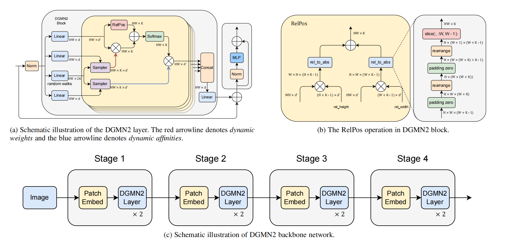

# 目录

<!-- TOC -->

- [目录](#目录)
- [DGMN2描述](#DGMN2描述)
- [模型架构](#模型架构)
- [数据集](#数据集)
- [环境要求](#环境要求)
- [快速入门](#快速入门)
- [脚本说明](#脚本说明)
    - [脚本及样例代码](#脚本及样例代码)
    - [脚本参数](#脚本参数)
    - [训练过程](#训练过程)
        - [分布式训练](#分布式训练)
    - [评估过程](#评估过程)
        - [评估](#评估)
     - [导出过程](#导出过程)
        - [导出](#导出)
- [模型描述](#模型描述)
    - [性能](#性能)
        - [评估性能](#评估性能)
            - [120万张图像上的DGMN2](#120万张图像上的DGMN2)
        - [推理性能](#推理性能)
            - [120万张图像上的DGMN2](#120万张图像上的DGMN2)
- [随机情况说明](#随机情况说明)
- [ModelZoo主页](#modelzoo主页)

<!-- /TOC -->

# DGMN2描述

DGMN2：Dynamic Graph Message Passing Networks \
一种动态图信息传递网络

[论文](https://arxiv.org/abs/1908.06955):  Zhang, Li and Chen, Mohan and Arnab, Anurag and Xue, Xiangyang and Torr, Philip H.S.. 2022.

# 模型架构



# 数据集

使用的数据集：[ImageNet2012](http://www.image-net.org/)

- 数据集大小：125G，共1000个类、125万张彩色图像
    - 训练集：120G，共120万张图像
    - 测试集：5G，共5万张图像
- 数据格式：RGB
    - 注：数据将在src/dataset.py中处理。

 ```text
└─dataset
    ├─train                # 训练集, 云上训练得是 .tar压缩文件格式
    └─val                  # 评估数据集
```

# 环境要求

- 硬件（Ascend/GPU/CPU）
    - 使用Ascend/GPU/CPU处理器来搭建硬件环境。
- 框架
    - [MindSpore](https://www.mindspore.cn/install/en)
- 如需查看详情，请参见如下资源：
    - [MindSpore教程](https://www.mindspore.cn/tutorials/zh-CN/master/index.html)
    - [MindSpore Python API](https://www.mindspore.cn/docs/api/zh-CN/master/index.html)

# 快速入门

通过官方网站安装MindSpore后，您可以按照如下步骤进行训练和评估：

- GPU处理器环境运行

  ```shell
  # CONFIG_PATH 在 ./config/*.yml 或者 *.ymal 路径下
  # 设置 device_target = 'GPU' 在 *.yml 或者 *.ymal 文件中
  cd scripts;
  bash run_standalone_train_gpu.sh [CONFIG_PATH]

  # 分布式训练
  cd scripts;
  bash run_distribute_train_gpu.sh [CONFIG_PATH]

  # 运行评估示例
  cd scripts;
  bash run_eval_gpu.sh [CONFIG_PATH]
  ```

- Ascend处理器环境运行

  ```shell
  # 运行训练示例 CONFIG_PATH配置文件请参考'./config'路径下相关文件
  # 启动单卡训练
  cd scripts;
  bash run_standalone_train_ascend.sh [CONFIG_PATH]

  # 启动多卡训练
  cd scripts;
  bash run_distribute_train_ascend.sh [RANK_TABLE_FILE] [CONFIG_PATH]

  # 运行评估示例
  cd scripts;
  bash run_eval_ascend.sh [CONFIG_PATH]
  ```

  对于分布式训练，需要提前创建JSON格式的hccl配置文件。

  请遵循以下链接中的说明：

 <https://gitee.com/mindspore/models/tree/master/utils/hccl_tools.>

- 在 ModelArts 进行训练 (参考文档 [modelarts](https://support.huaweicloud.com/modelarts/))

    - 在 ModelArts 上使用8卡训练 ImageNet 数据集

      ```text
      # (1) 上传你的压缩数据集到 S3 桶上 (你也可以上传原始的数据集，但那可能会很慢。)
      # (2) 上传代码到S3桶上
      # (3) 在算法管理界面创建算法，在网页上设置代码目录和启动文件(train.py)
      # (4) 添加输入数据配置，代码路径参数为data_url; 添加输出数据配置，代码路径参数为train_url
      # (5) 选择算法创建训练作业，设置"config_path='/path_to_code/config/dgmn2_tiny_graph_O3.yml'"
      # (6) 配置超参
      #          在网页上设置 "enable_modelarts=True"
      #          在*.yml文件上设置 其他参数
      # (7) 在网页上设置"训练数据集"、"训练输出文件路径"、"作业日志路径"等
      # (8) 创建训练作业
      ```

    - 在 ModelArts 上使用多卡验证 ImageNet 数据集

      ```text
      # (1) 在算法管理界面创建算法，在网页上设置代码目录和启动文件(eval.py)
      # (2) 添加输入数据配置，代码路径参数为data_url; 添加输出数据配置，代码路径参数为train_url
      # (3) 选择算法创建训练作业，设置"config_path='/path_to_code/config/DGMN2_eval.yml'"; 设置"pretrained='path_to_ckpt'"
      # (4) 配置超参
      #          在网页上设置 "enable_modelarts=True"
      #          在*.yml文件上设置 其他参数
      # (5) 在网页上设置"训练数据集"、"训练输出文件路径"、"作业日志路径"等
      # (6) 创建训练作业
      ```

# 脚本说明

## 脚本及样例代码

```text
├── model_zoo
    ├── README.md                            // 所有模型相关说明
    ├── DGMN2
        ├── README_CN.md                        // dgmn2模型相关说明
        ├── scripts
        │   ├──run_distribute_train_ascend.sh     // Ascend分布式训练
        │   ├──run_distribute_train_gpu.sh        // GPU分布式训练
        │   ├──run_eval_ascend.sh                 // Ascend评估脚本
        │   ├──run_eval_gpu.sh                    // GPU评估脚本
        │   ├──run_standalone_train_ascend.sh     // Ascend单卡训练
        │   ├──run_standalone_train_gpu.sh        // GPU单卡训练
        ├── src
        │   ├──autoaugment.py                // 数据自动增强策略
        │   ├──callback.py                   // 打印结果的回调函数
        │   ├──cross_entropy.py              // ce loss函数
        │   ├──dataset.py                    // 创建数据集
        │   ├──eval_engine.py                // 评估策略
        │   ├──logging.py                    // 自定义日志打印策略
        │   ├──lr_generator.py               // lr的策略
        │   ├──metric.py                     // 评估结果计算方式
        │   ├──optimizer.py                  // 优化器
        │   ├──dcn_v2.py                     // 动态采样函数
        │   ├──dgmn2.py                      // 模型结构
        │   ├──model_utils                   // 云上训练依赖
        ├── config
        │   ├──dgmn2_eval.yml                // 评估配置
        │   ├──dgmn2_export.yml              // 转模型配置
        │   ├──dgmn2_tiny_graph_O3.yml       // 8p云上训练参数配置
        │   ├──dgmn2_config.yml              // 基本训练参数配置
        ├──DGMN2.png                         // 网络结构图
        ├── train.py                         // 训练脚本
        ├── eval.py                          // 评估脚本
        ├── export.py                        // 模型转 air/mindir类型
        ├── requirements.txt                 // 依赖python包
```

## 脚本参数

在./config/.yml中可以同时配置训练参数和评估参数。

- dgmn2和ImageNet数据集配置。

  ```text
  enable_modelarts: 1               # 是否云上训练

  # modelarts云上参数
  data_url: ""                      # S3 数据集路径
  train_url: ""                     # S3 输出路径
  checkpoint_url: ""                # S3 预训练模型路径
  output_path: "/cache/train"       # 真实的云上机器路径，从train_url拷贝
  data_path: "/cache/datasets/imagenet" # 真实的云上机器路径，从data_url拷贝
  load_path: "/cache/model/dgmn2_tiny.ckpt" #真实的云上机器路径，从checkpoint_url拷贝

  # 训练数据集
  dataset_path: '/cache/datasets/imagenet/train' # 训练数据集路径
  train_image_size: 224             # 输入图片的宽高
  interpolation: 'BILINEAR'         # 图片预处理的插值算法
  crop_min: 0.05                    # random crop 最小参数
  batch_size: 64                   # 训练batch size
  train_num_workers: 14             # 并行work数量

  # 评估数据集
  eval_path: '/cache/datasets/imagenet/val' # eval dataset
  eval_image_size: 224              # 输入图片的宽高
  eval_batch_size: 64              # 评估batch size
  eval_interval: 1                  # 评估 interval
  eval_offset: -1                   # 评估 offset
  eval_num_workers: 12              # 并行work数量

  # 网络
  backbone: 'dgmn2_tiny'          # 网络backbone选择
  class_num: 1000                   # 训练数据集类别数
  dgmn2_config_path: 'src.dgmn2.DGMN2Config'
  pretrained: ''                    # 预训练模型路径, '' 指重头开始训练

  # lr
  lr_decay_mode: 'cosine'           # lr下降类型选择，支持cos、exp等，具体见lr_generator.py
  lr_init: 0.0                      # 初始的lr(epoch 0)
  lr_max: 0.0006                     # 最大的lr
  lr_min: 1e-5                       # 最后一个step的lr值
  max_epoch: 300                    # 总的epoch
  warmup_epochs: 5                 # warmup epoch值

  # 优化器
  opt: 'adamw'                      # 优化器类型
  beta1: 0.9                        # adam beta参数
  beta2: 0.999                      # adam beta参数
  weight_decay: 0.05                # weight decay知
  no_weight_decay_filter: "beta,bias" # 哪些权重不用weight decay
  gc_flag: 0                        # 是否使用gc

  # loss, 有些参数也用于dataset预处理
  loss_scale: 1024                  # amp 静态loss scale值
  use_label_smooth: 1               # 是否使用 label smooth
  label_smooth_factor: 0.1          # label smooth因子的值
  mixup: 0.2                        # 是否使用mixup
  autoaugment: 1                    # 是否使用autoaugment
  loss_name: "ce_smooth_mixup"      # loss类别选择, 详情看cross_entropy.py

  # ckpt
  save_checkpoint: 1                # 是否保存训练结果
  save_checkpoint_epochs: 8         # 每隔多少个epoch存储一次
  keep_checkpoint_max: 3            # 最多保留的结果数
  save_checkpoint_path: './outputs' # 训练结果存储目录

  # profiler
  open_profiler: 0 # 是否开启性能评估，使用时最好用个小数据集+max_epoch设为1.

  # train
  context_mode: 0                   # 设置图模式，0为静态图，1为动态图
  device_target: "Ascend"           # 训练设备，可选择 "Ascend" 和 "GPU"
  amp_level: "O3"                   # amp，O3为全网下沉float16
  run_distribute: 1                 # 是否进行分布式训练，GPU默认8p
  ```

更多配置细节请参考脚本`train.py`, `eval.py`, `export.py` 和 `config/*.yml`。

## 训练过程

### 分布式训练

- Ascend处理器环境运行

  modelarts
  参考[快速入门](#快速入门)

  ```log
  ## log example
  2022-06-05 15:06:30:INFO:epoch[1], epoch time: 3247.40s, per step time: 1.2979s, loss=6.397223, lr=0.000120, fps=394.48, accuracy=0.049780, eval_cost=144.56
  2022-06-05 15:52:35:INFO:epoch[2], epoch time: 2726.28s, per step time: 1.0896s, loss=6.023053, lr=0.000240, fps=469.88, accuracy=0.165540, eval_cost=38.19
  2022-06-05 16:38:39:INFO:epoch[3], epoch time: 2726.04s, per step time: 1.0895s, loss=4.892248, lr=0.000360, fps=469.92, accuracy=0.254740, eval_cost=38.30
  2022-06-05 17:24:43:INFO:epoch[4], epoch time: 2725.93s, per step time: 1.0895s, loss=4.916058, lr=0.000480, fps=469.94, accuracy=0.339440, eval_cost=38.23
  ...
  ```

## 评估过程

### 评估

- 在Ascend环境运行时评估ImageNet数据集

  ```shell
  # GPU RTX3090
  bash run_eval_gpu.sh [CONFIG_PATH]
  accuracy=0.776720, per step time: 0.6395s
  ```

## 导出过程

### 导出

在导出之前需要修改数据集对应的配置文件，config/export.yml. 需要修改的配置项为 batch_size 和 ckpt_file.

```python
python export.py --config_path=[CONFIG_PATH]
# 导出的 .mindir文件保存在export.pyx相同路径下
```

# 模型描述

## 性能

### 评估性能

#### imagenet 120万张图像上的DGMN2

| 参数                       | Ascend                                                      |
| -------------------------- | -----------------------------------------------------------|
| 模型版本                   | DGMN2_tiny                                                  |
| MindSpore版本              | 1.5.1                                                      |
| 数据集                     | 120万张图像                                                  |
| 训练参数                   | epoch=300, batch_size=64, lr=0.0006        |
| 优化器                     | Adamw                                                       |
| 损失函数                   | Softmax交叉熵                                                |
| 输出                       | 概率                                                        |
| 损失                       | 1.0                                                         |
| 速度                       | 8卡：1089毫秒/步                            |
| 总时长                     | 8卡：231小时                                                  |
| 参数(M)                    | 12.1                                                        |
| 脚本                    | [DGMN2脚本](https://gitee.com/mindspore/models/tree/master/research/cv/DGMN2) |

### 推理性能

#### 5万张图像上的DGMN2

| 参数                | Ascend                      |
| ------------------- | --------------------------- |
| 模型版本            | DGMN2_tiny                          |
| 资源                |  Ascend 910                  |
| MindSpore版本       | 1.7.0                        |
| 数据集              | ImageNet val                   |
| batch_size          | 64                          |
| 输出                | 概率                         |
| 准确性              | 77.67%             |

# ModelZoo主页

 请浏览官网[主页](https://gitee.com/mindspore/models)。
